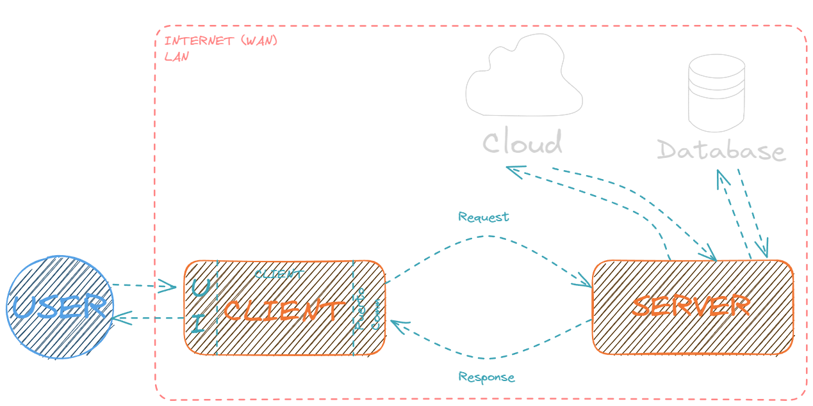

<h1 align="center"> INTERNET </h1>

Internet es una red de redes de dispositivos infomáticos interconectados que crean un medio para compartir información en tiempo real. Para que la comunicación entre estos dispositivos sea posible, es necesario que todos "hablen" el mismo idioma, esdecir, que tengan el mismo sistema que determine la forma en que se comuniquen. Con este propósito es que se desarrollan los protocolos de comunicación.

<h2 align="center"> Familia de protocolos </h2>

Para que Internet y todo su entramado de comunicaciones sea posible, se desarrollaron una familia de protocolos que constituyen su arquitectura básica fundamental:

- El protocolo Ethernet es el que define las características del cableado y de la forma que tienen que tener las tramas de datos. Se ocupa de la capa física.

- La capa de **RED** o capa **IP**, es la encargada de aceptar y transferir paquetes para la red. Está compuesta por un conjunto de protocolos, siendo uno de los más conocidos el **Protocolo de Internet**, o **IP** (Internet Protocol por sus siglas en inglés). Estos se encargan de configurar las direcciones IP, determinar la ruta que tendrá cierto paquete, agrupar paquetes de datos en unidades conocidas como datagramas, y, en el caso de que un paquete sea demasiado grande, lo subdivide en paquetes de menor tamaño.

- El Protocolo de Control de Transmisión, o TCP (Transmission Control Protocol), se encuentra en la capa encargada del transporte y su objetivo es asegurar que los datos emitidos por el Cliente sean recibidos sin errores y en el mismos orden por el Servidor.

- La capa más superficial es la de aplicación, cuya función es la de dar la posibilidad a las aplicaciones de acceder a los servicios que las otras capas ofrecen, y define los protocolos que utilizan las apps para intercambiar datos, como FTP o HTTP.

<h2 align="center"> Application Layer o Capa de Aplicación </h2>

Importante aclarar que el usuario rara vez interactúa directamente con la capa de aplicación, sino que lo hace con una aplicación que se encarga de interactuar con ella. Por ejemplo, un usuario no hace él mismo una petición del tipo **GET** a *"https://www.api.com/index.html"* e interpreta directamente el JSON crudo. En su lugar, el interactúa con una GUI desarrollada por programadores que a su vez interactúa con algún software backend, y este último es el encargado de solicitar información al servidor. 

<h2 align="center"> Protocolo HTTP </h2>

El Protocolo de Transferencia de HiperTexto (en inglés, **H**yper**T**ext **T**ransfer **P**rotocol) es el protocolo de comunicación que permite las transferencias de información usando archivos HTML, XML, en la **W**orld **W**ide **W**eb. Es decir, es uno de los que hace posible el intercambio de datos a través de Internet. 

Es un protocolo orientado a transacciones, que sigue el esquema petición-respuesta (request-response) entre un cliente y un servidor. El cliente (user agent) realiza una solicitud al servidor enviando un mensaje con cierto formato.

<h3 align="center"> Modelo Cliente-Servidor </h3>

Esta red de redes de computadoras interconectadas se comunican entre sí, y lo hacen en parte gracias al protocolo HTTP, que establece que cada dispositivo conectado a la red, tiene un rol en especifico: cliente o servidor.

La computadora o dispositivo que necesita cierta información, es la que cumplirá el rol de cliente, el cual es el encargado de iniciar la comunicación mediante un solicitud a algún servidor, que es el que contiene la información que el cliente necesita. Por ejemplo, necesitamos saber la temperatura actual de la ciudad de Buenos Aires, para esto, solicitamos esta data a un servidor que contenga información del clima, y este servidor nos responderá con la data que queremos.

<h3 align="center"> Métodos y Códigos de Estado </h3>

Todas las acciones que podemos ejecutar en un servidor están ya predeterminadas y se denominan **VERBOS HTTP** o **MÉTODOS**. Las acciones principales más utilizadas por los servidores son la lectura de información, creación de nuevo contenido, actualización y eliminación (C.R.U.D.: Create, Read, Update y Delete). Veamos los métodos HTTP más usados que nos permiten realizarlas: 

- POST (Create): Crea nuevo contenido.
- GET (Read): Obtiene contenido.
- PATCH | PUT (Update): Actualiza contenido.
- DELETE (Delete): Elimina contenido.

Una vez hecha la solicitud, el servidor nos responde con un código que sirve para identificar el estado de la respuesta. Los códigos de estado de las respuestas HTTP indican si una solicitud HTTP especifica fue completeda con satisfacción o no. Las distintas posibilidades están referenciadas según unos códigos de estado:

- **100 - 101 >** Respuestas informativas.
- **200 - 206 >** Respuestas satisfactorias.
- **300 - 307 >** Redirecciones.
- **400 - 426 >** Errores de los clientes.
- **500 - 505 >** Errores de los servidores.

<h1 align="center"> LINKS </h1>

- [What is Internet?](https://www.geeksforgeeks.org/what-is-internet-definition-uses-working-advantages-and-disadvantages/)
- [Familia de protocolos de InterNET](https://es.wikipedia.org/wiki/Familia_de_protocolos_de_internet)
- [Capa de aplicación](https://es.wikipedia.org/wiki/Capa_de_aplicaci%C3%B3n)
- [Códigos de estado con gatitos](https://http.cat/)
